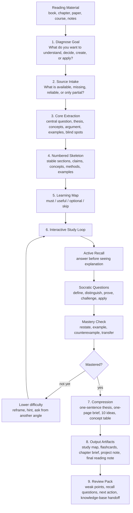

# Interactive Reading Skill

Codex skill for turning books, chapters, papers, courses, transcripts, meeting notes, and other static material into an interactive mastery workflow.

## Reading Flow



## Why This Skill Is Useful

Most reading workflows stop at summaries. This skill is built for mastery: it helps an agent turn static material into a guided learning process with diagnosis, structure, questioning, application, compression, and review.

Use it when you want an agent to help you:

- Read around a real goal instead of passively following the author's order.
- Extract the central question, thesis, key concepts, argument chain, examples, blind spots, and skippable sections.
- Build a numbered skeleton and learning map so every concept, claim, method, and example can be referenced later.
- Run Socratic study loops that make the learner recall, explain, compare, critique, and apply ideas instead of only receiving answers.
- Check whether a unit is actually mastered through restatement, examples, counterexamples, and transfer to the learner's own context.
- Compress a book into reusable forms such as a one-sentence thesis, one-page brief, 10 core ideas, concept table, argument chain, project implications, and review questions.
- Produce durable artifacts: study maps, flashcards, chapter briefs, practice tasks, decision trees, teaching scripts, project notes, and final reading notes.

## What Makes It Different

- **Goal-first reading**: the workflow starts from what the learner wants to understand, decide, write, teach, build, create, invest, examine, or act on.
- **Core extraction before teaching**: the agent separates what the source actually says from interpretation, external knowledge, and personal application.
- **Stable structure**: numbered sections and units make long reading projects easier to continue across multiple turns.
- **Active learning**: the agent is instructed to ask progressively, lower difficulty when the learner is stuck, and avoid giving away the final answer too early.
- **Transfer-focused output**: the skill pushes the reading process toward real decisions, projects, writing, behavior change, or teaching.
- **Review-ready closeout**: substantial reading runs end with recall questions, weak points, flashcards, next actions, and a decision about whether the note is ready for long-term knowledge-base filing.

## Example Uses

```text
Use $interactive-reading to build a learning map for this book.
```

```text
Use $interactive-reading to extract the core argument of this chapter and quiz me until I can explain it.
```

```text
Use $interactive-reading to apply this writing book to my current screenplay project.
```

```text
Use $interactive-reading to turn these meeting notes into a study path and review pack.
```

## Quick Start

Give this repository link to your Codex agent and ask it to install the skill:

```text
Please install this Codex skill:
https://github.com/Kiro-shi/interactive-reading-skill

Use $skill-installer. The skill path inside the repo is interactive-reading.
```

The agent should install the `interactive-reading` folder from this repository into your local Codex skills directory. After installation, start a new turn or restart Codex if the skill does not appear immediately.

Then invoke it with:

```text
$interactive-reading
```

Example:

```text
Use $interactive-reading to turn this book into an interactive study workflow.
```

## Installer Command

In Codex, ask:

```text
Use $skill-installer to install the interactive-reading skill from Kiro-shi/interactive-reading-skill, path interactive-reading.
```

If you want to pin an exact version, ask your agent to install a specific commit hash:

```text
Use $skill-installer to install the interactive-reading skill from Kiro-shi/interactive-reading-skill, path interactive-reading, ref <commit-hash>.
```

## Manual Install

Copy the `interactive-reading` folder into your Codex skills directory:

```text
~/.codex/skills/interactive-reading
```

The skill folder must contain `SKILL.md` at its root.
